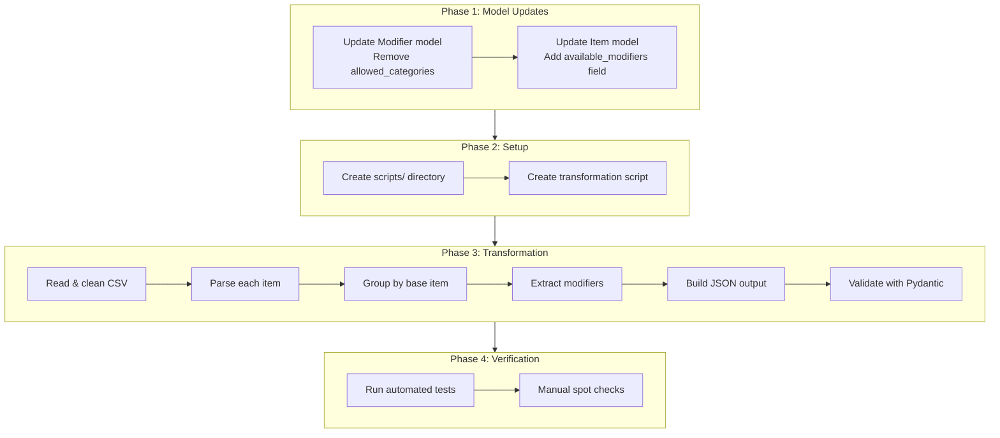
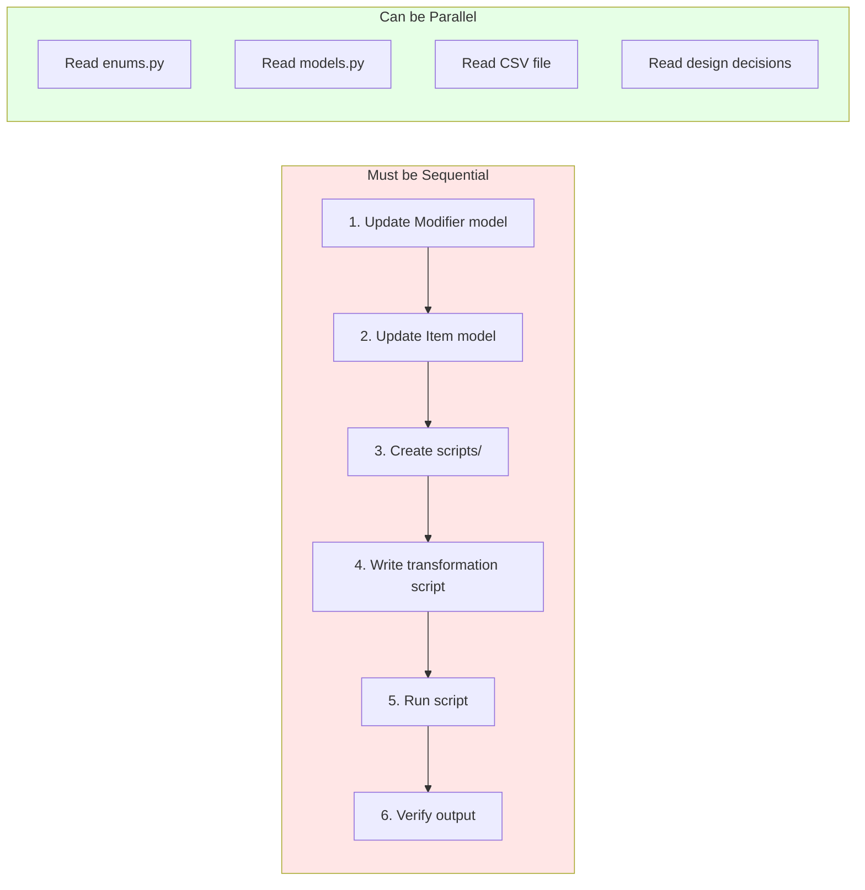
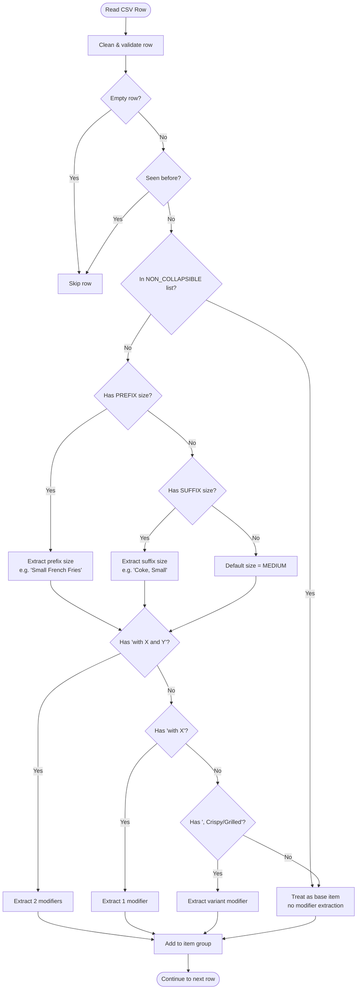
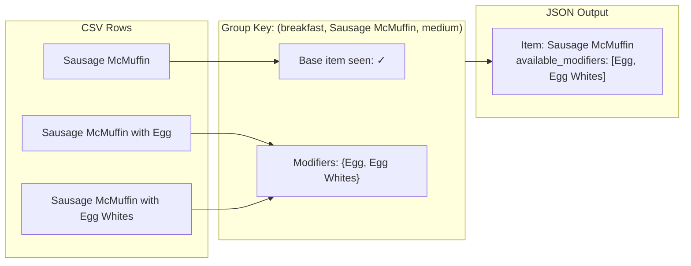

# CSV to JSON Transformation Plan (v4) - Corrected & Agent-Ready

> **Status:** READY FOR IMPLEMENTATION
> **Supersedes:** `2026-02-02-csv-to-json-transformation-v3.md`
> **Design Decisions:** `2026-02-02-modifier-extraction-questions.md`

## Overview

Transform `menus/transformed-data/mcdonalds-menu-items-revised-full.csv` into a validated JSON file that:
1. Collapses variant items into base Items with extracted modifiers
2. Handles edge cases (duplicates, prefix sizes, non-collapsible "with" patterns)
3. Validates against updated Pydantic models

---

## High-Level Workflow



---

## Sequential vs Parallel Tasks



---

## Phase 1: Update Pydantic Models

- [x] Task 1.1: Update Modifier Model (REQUIRED FIRST)
- [x] Task 1.2: Update Item Model (AFTER Task 1.1)

### Task 1.1: Update Modifier Model (REQUIRED FIRST)

**File:** `src/models.py`

**Current State:**
```python
class Modifier(BaseModel):
    modifier_id: str
    name: str
    allowed_categories: list[CategoryName] = Field(default_factory=list)
```

**Required Change - REMOVE `allowed_categories`:**
```python
class Modifier(BaseModel):
    modifier_id: str
    name: str
```

**Rationale:** Per design decision Q5, modifiers are stored at Item level only. The `allowed_categories` field is no longer needed.

### Task 1.2: Update Item Model (AFTER Task 1.1)

**File:** `src/models.py`

**Current State:**
```python
class Item(BaseModel):
    item_id: str
    name: str
    category_name: CategoryName
    size: Size = Field(default=Size.MEDIUM)
    quantity: int = Field(default=1, ge=1)
    modifiers: list[Modifier] = Field(default_factory=list)
```

**Required Change - ADD `available_modifiers`:**
```python
class Item(BaseModel):
    item_id: str
    name: str
    category_name: CategoryName
    size: Size = Field(default=Size.MEDIUM)
    quantity: int = Field(default=1, ge=1)
    modifiers: list[Modifier] = Field(default_factory=list)  # Customer selections (for orders)
    available_modifiers: list[Modifier] = Field(default_factory=list)  # Menu options
```

---

## Phase 2: Create Transformation Script

- [x] Task 2.1: Create scripts directory
- [x] Task 2.2: Create transformation script

### Task 2.1: Create scripts directory

```bash
mkdir -p scripts
```

### Task 2.2: Create transformation script

**File:** `scripts/csv_to_json_v4.py`

---

## Detailed Parsing Rules

### Rule 1: Size Detection (SUFFIX pattern)

Matches items ending with size indicator after comma:

```python
SUFFIX_SIZE_PATTERN = re.compile(
    r"^(.+?),\s*(Small|Medium|Large|Kids|Regular|Snack|\d+\s*pc)$",
    re.IGNORECASE
)
```

**Examples:**
- `"Coca-Cola Classic, Small"` → name=`"Coca-Cola Classic"`, size=`SMALL`
- `"Chicken McNuggets, 10 pc"` → name=`"Chicken McNuggets"`, size=`MEDIUM` (10pc maps to medium)

### Rule 2: Size Detection (PREFIX pattern) - NEW

Matches items starting with size indicator:

```python
PREFIX_SIZE_PATTERN = re.compile(
    r"^(Small|Medium|Large|Kids)\s+(.+)$",
    re.IGNORECASE
)
```

**Examples:**
- `"Small French Fries"` → name=`"French Fries"`, size=`SMALL`
- `"Kids French Fries"` → name=`"French Fries"`, size=`SMALL`

### Rule 3: "with X and Y" Detection

```python
WITH_AND_PATTERN = re.compile(
    r"^(.+?)\s+with\s+(.+?)\s+and\s+(.+)$",
    re.IGNORECASE
)
```

**Example:**
- `"Big Breakfast with Hotcakes and Egg Whites"` → base=`"Big Breakfast"`, modifiers=`["Hotcakes", "Egg Whites"]`

### Rule 4: "with X" Detection

```python
WITH_PATTERN = re.compile(
    r"^(.+?)\s+with\s+(.+)$",
    re.IGNORECASE
)
```

**Examples:**
- `"Sausage McMuffin with Egg"` → base=`"Sausage McMuffin"`, modifiers=`["Egg"]`
- `"Mocha with Nonfat Milk"` → base=`"Mocha"`, modifiers=`["Nonfat Milk"]`

### Rule 5: Suffix Variant Detection (Crispy/Grilled)

```python
SUFFIX_VARIANT_PATTERN = re.compile(
    r"^(.+?),\s*(Crispy Chicken|Grilled Chicken)$",
    re.IGNORECASE
)
```

**Example:**
- `"Premium McWrap Chicken & Bacon, Crispy Chicken"` → base=`"Premium McWrap Chicken & Bacon"`, modifiers=`["Crispy Chicken"]`

### Rule 6: Non-Collapsible "with" Items (EXCEPTION LIST)

These items use "with" but should NOT be collapsed:

```python
NON_COLLAPSIBLE_PREFIXES = [
    "McFlurry with",      # Each flavor is a distinct product
]
```

**Example:**
- `"McFlurry with M&Ms Candies, Small"` → Stays as separate item, NOT modifier on "McFlurry"

---

## Decision Flow for Each CSV Row



---

## Grouping Logic

Items are grouped by: `(category, base_name, size)`

Each group produces ONE output Item with all modifiers collected.



---

## Category Mapping

| CSV Category | Enum Value |
|--------------|------------|
| Breakfast | `breakfast` |
| Beef & Pork | `beef-pork` |
| Chicken & Fish | `chicken-fish` |
| Salads | `salads` |
| Snacks & Sides | `snacks-sides` |
| Desserts | `desserts` |
| Beverages | `beverages` |
| Coffee & Tea | `coffee-tea` |
| Smoothies & Shakes | `smoothies-shakes` |

---

## Size Mapping

| CSV Pattern | Size Enum |
|-------------|-----------|
| Small, Kids | `small` |
| Medium, Regular | `medium` |
| Large | `large` |
| Snack | `snack` |
| 4 pc | `snack` |
| 6 pc | `small` |
| 10 pc | `medium` |
| 20 pc, 40 pc | `large` |

---

## Complete Implementation Script

**File:** `scripts/csv_to_json_v4.py`

```python
"""
Transform McDonald's menu CSV to JSON with modifier extraction.

Usage:
    uv run python scripts/csv_to_json_v4.py

Output:
    menus/transformed-data/menu.json
"""

import csv
import json
import re
import sys
from collections import defaultdict
from pathlib import Path

# Add src to path for imports
sys.path.insert(0, str(Path(__file__).parent.parent / "src"))

from enums import CategoryName, Size
from models import Item, Menu, Modifier


# =============================================================================
# CONFIGURATION
# =============================================================================

CSV_PATH = Path("menus/transformed-data/mcdonalds-menu-items-revised-full.csv")
OUTPUT_PATH = Path("menus/transformed-data/menu.json")

CATEGORY_MAP = {
    "Breakfast": CategoryName.BREAKFAST,
    "Beef & Pork": CategoryName.BEEF_PORK,
    "Chicken & Fish": CategoryName.CHICKEN_FISH,
    "Salads": CategoryName.SALADS,
    "Snacks & Sides": CategoryName.SNACKS_SIDES,
    "Desserts": CategoryName.DESSERTS,
    "Beverages": CategoryName.BEVERAGES,
    "Coffee & Tea": CategoryName.COFFEE_TEA,
    "Smoothies & Shakes": CategoryName.SMOOTHIES_SHAKES,
}

SIZE_WORDS_MAP = {
    "small": Size.SMALL,
    "medium": Size.MEDIUM,
    "large": Size.LARGE,
    "kids": Size.SMALL,
    "regular": Size.MEDIUM,
    "snack": Size.SNACK,
}

PC_SIZE_MAP = {
    4: Size.SNACK,
    6: Size.SMALL,
    10: Size.MEDIUM,
    20: Size.LARGE,
    40: Size.LARGE,
}

# Items that use "with" but should NOT have modifiers extracted
NON_COLLAPSIBLE_PREFIXES = [
    "McFlurry with",
]


# =============================================================================
# REGEX PATTERNS
# =============================================================================

# Size patterns
SUFFIX_SIZE_PATTERN = re.compile(
    r"^(.+?),\s*(Small|Medium|Large|Kids|Regular|Snack|\d+\s*pc)$",
    re.IGNORECASE
)
PREFIX_SIZE_PATTERN = re.compile(
    r"^(Small|Medium|Large|Kids)\s+(.+)$",
    re.IGNORECASE
)

# Modifier patterns (order matters - check most specific first)
WITH_AND_PATTERN = re.compile(
    r"^(.+?)\s+with\s+(.+?)\s+and\s+(.+)$",
    re.IGNORECASE
)
WITH_PATTERN = re.compile(
    r"^(.+?)\s+with\s+(.+)$",
    re.IGNORECASE
)
SUFFIX_VARIANT_PATTERN = re.compile(
    r"^(.+?),\s*(Crispy Chicken|Grilled Chicken)$",
    re.IGNORECASE
)


# =============================================================================
# HELPER FUNCTIONS
# =============================================================================

def slugify(text: str) -> str:
    """Convert text to kebab-case slug for IDs."""
    text = text.lower()
    text = re.sub(r"[^a-z0-9]+", "-", text)
    return text.strip("-")


def is_non_collapsible(item_name: str) -> bool:
    """Check if item should NOT have modifiers extracted."""
    for prefix in NON_COLLAPSIBLE_PREFIXES:
        if item_name.startswith(prefix):
            return True
    return False


def extract_size(item_name: str) -> tuple[str, Size]:
    """
    Extract size from item name.

    Returns: (name_without_size, Size)
    """
    # Check suffix pattern first (e.g., "Coca-Cola, Small")
    suffix_match = SUFFIX_SIZE_PATTERN.match(item_name)
    if suffix_match:
        name = suffix_match.group(1).strip()
        size_str = suffix_match.group(2).lower()

        # Handle piece counts
        if "pc" in size_str:
            pc_match = re.search(r"(\d+)", size_str)
            if pc_match:
                pc = int(pc_match.group(1))
                return name, PC_SIZE_MAP.get(pc, Size.MEDIUM)

        return name, SIZE_WORDS_MAP.get(size_str, Size.MEDIUM)

    # Check prefix pattern (e.g., "Small French Fries")
    prefix_match = PREFIX_SIZE_PATTERN.match(item_name)
    if prefix_match:
        size_str = prefix_match.group(1).lower()
        name = prefix_match.group(2).strip()
        return name, SIZE_WORDS_MAP.get(size_str, Size.MEDIUM)

    # No size pattern found
    return item_name, Size.MEDIUM


def parse_item(item_name: str) -> dict:
    """
    Parse item name into components.

    Returns dict with:
        - base_name: str
        - modifiers: list[str]
        - size: Size
        - is_base_item: bool (True if no modifiers extracted)
    """
    # First extract size
    name_no_size, size = extract_size(item_name)

    # Check if this item should not have modifiers extracted
    if is_non_collapsible(name_no_size):
        return {
            "base_name": name_no_size,
            "modifiers": [],
            "size": size,
            "is_base_item": True,
        }

    # Check for suffix variant (Crispy/Grilled Chicken) - BEFORE checking "with" patterns
    # This handles "Premium McWrap..., Crispy Chicken"
    suffix_match = SUFFIX_VARIANT_PATTERN.match(name_no_size)
    if suffix_match:
        return {
            "base_name": suffix_match.group(1).strip(),
            "modifiers": [suffix_match.group(2).strip()],
            "size": size,
            "is_base_item": False,
        }

    # Check for "with X and Y" pattern
    with_and_match = WITH_AND_PATTERN.match(name_no_size)
    if with_and_match:
        return {
            "base_name": with_and_match.group(1).strip(),
            "modifiers": [
                with_and_match.group(2).strip(),
                with_and_match.group(3).strip()
            ],
            "size": size,
            "is_base_item": False,
        }

    # Check for "with X" pattern
    with_match = WITH_PATTERN.match(name_no_size)
    if with_match:
        return {
            "base_name": with_match.group(1).strip(),
            "modifiers": [with_match.group(2).strip()],
            "size": size,
            "is_base_item": False,
        }

    # No pattern matched - this is a base item
    return {
        "base_name": name_no_size,
        "modifiers": [],
        "size": size,
        "is_base_item": True,
    }


# =============================================================================
# MAIN TRANSFORMATION
# =============================================================================

def main():
    print(f"Reading CSV: {CSV_PATH}")

    # Track seen items to handle duplicates
    seen_items: set[tuple[str, str]] = set()

    # Group items by (category, base_name, size)
    # Value: {"modifiers": set(), "has_base": bool}
    item_groups: dict[tuple, dict] = defaultdict(
        lambda: {"modifiers": set(), "has_base": False}
    )

    # Track statistics
    stats = {
        "total_rows": 0,
        "skipped_empty": 0,
        "skipped_duplicate": 0,
        "skipped_unknown_category": 0,
        "processed": 0,
    }

    with open(CSV_PATH, newline="", encoding="utf-8") as f:
        reader = csv.DictReader(f)

        for row in reader:
            stats["total_rows"] += 1

            # Clean row data
            category_csv = row.get("Category", "").strip()
            item_name = row.get("Item", "").strip()

            # Skip empty rows
            if not category_csv or not item_name:
                stats["skipped_empty"] += 1
                continue

            # Skip duplicates
            dup_key = (category_csv, item_name)
            if dup_key in seen_items:
                stats["skipped_duplicate"] += 1
                continue
            seen_items.add(dup_key)

            # Map category
            category = CATEGORY_MAP.get(category_csv)
            if not category:
                print(f"  Warning: Unknown category '{category_csv}' - skipping")
                stats["skipped_unknown_category"] += 1
                continue

            # Parse item
            parsed = parse_item(item_name)
            group_key = (category, parsed["base_name"], parsed["size"])

            # Update group
            if parsed["modifiers"]:
                item_groups[group_key]["modifiers"].update(parsed["modifiers"])
            if parsed["is_base_item"]:
                item_groups[group_key]["has_base"] = True

            stats["processed"] += 1

    print(f"\nCSV Processing Stats:")
    print(f"  Total rows: {stats['total_rows']}")
    print(f"  Skipped empty: {stats['skipped_empty']}")
    print(f"  Skipped duplicate: {stats['skipped_duplicate']}")
    print(f"  Skipped unknown category: {stats['skipped_unknown_category']}")
    print(f"  Processed: {stats['processed']}")

    # Build items list
    items = []
    for (category, base_name, size), data in item_groups.items():
        # Create available_modifiers list
        available_modifiers = [
            Modifier(modifier_id=slugify(m), name=m)
            for m in sorted(data["modifiers"])
        ]

        # Generate item_id (include size if not medium)
        item_id = slugify(base_name)
        if size != Size.MEDIUM:
            item_id = f"{item_id}-{size.value}"

        item = Item(
            item_id=item_id,
            name=base_name,
            category_name=category,
            size=size,
            quantity=1,
            modifiers=[],
            available_modifiers=available_modifiers,
        )
        items.append(item)

    # Sort by category then name
    items.sort(key=lambda x: (x.category_name.value, x.name))

    print(f"\nGenerated {len(items)} items")

    # Count items with modifiers
    with_mods = sum(1 for i in items if i.available_modifiers)
    print(f"Items with available_modifiers: {with_mods}")

    # Build menu
    menu = Menu(
        menu_id="mcd-main-menu",
        name="McDonald's Menu",
        items=items,
    )

    # Validate by converting to dict and back
    print("\nValidating with Pydantic...")
    menu_dict = menu.model_dump()
    Menu.model_validate(menu_dict)
    print("Validation passed!")

    # Write output
    with open(OUTPUT_PATH, "w", encoding="utf-8") as f:
        json.dump(menu_dict, f, indent=2)

    print(f"\nOutput written to: {OUTPUT_PATH}")

    # Print sample output for verification
    print("\n--- Sample Items ---")
    sample_items = [
        "Sausage McMuffin",
        "Quarter Pounder",
        "Double Quarter Pounder",
        "McDouble",
        "Bacon McDouble",
        "Premium McWrap Chicken & Bacon",
        "McFlurry with M&Ms Candies",
    ]
    for sample_name in sample_items:
        for item in items:
            if item.name == sample_name:
                mods = [m.name for m in item.available_modifiers]
                print(f"  {item.name} ({item.size.value}): {mods if mods else '(no modifiers)'}")
                break


if __name__ == "__main__":
    main()
```

---

## Phase 3: Execution

- [x] Task 3.1: Run Transformation

### Task 3.1: Run Transformation

```bash
uv run python scripts/csv_to_json_v4.py
```

### Expected Console Output

```
Reading CSV: menus/transformed-data/mcdonalds-menu-items-revised-full.csv

CSV Processing Stats:
  Total rows: 267
  Skipped empty: 2
  Skipped duplicate: 5
  Skipped unknown category: 0
  Processed: 260

Generated ~180 items
Items with available_modifiers: ~25

Validating with Pydantic...
Validation passed!

Output written to: menus/transformed-data/menu.json
```

---

## Phase 4: Verification

- [x] Task 4.1: Automated Verification
- [ ] Task 4.2: Manual Verification Checklist (awaiting human review)

### Task 4.1: Automated Verification

```bash
# Verify script runs without errors
uv run python scripts/csv_to_json_v4.py

# Verify JSON validates against Menu model
uv run python -c "
from src.models import Menu
import json
with open('menus/transformed-data/menu.json') as f:
    data = json.load(f)
menu = Menu.model_validate(data)
print(f'Valid menu with {len(menu.items)} items')
"
```

### Task 4.2: Manual Verification Checklist

| Check | Expected Result | Status |
|-------|-----------------|--------|
| Sausage McMuffin | `available_modifiers: [Egg, Egg Whites]` | ☑ PASS |
| Quarter Pounder | `available_modifiers: [Bacon & Cheese, Bacon Habanero Ranch, Cheese]` | ☑ PASS (Note: Deluxe is separate item per design) |
| Double Quarter Pounder | Separate item with `[Cheese]` | ☑ PASS |
| McDouble | Separate item, NO modifiers | ☑ PASS |
| Bacon McDouble | Separate item, NO modifiers | ☑ PASS |
| Premium McWrap Chicken & Bacon | `[Crispy Chicken, Grilled Chicken]` | ☑ PASS |
| McFlurry with M&Ms Candies | Separate item (not collapsed) | ☑ PASS (9 McFlurry items total) |
| McFlurry with Oreo Cookies | Separate item (not collapsed) | ☑ PASS |
| French Fries | 3 separate items by size (Kids→Small per design) | ☑ PASS |
| Coca-Cola Classic | 3 separate items by size (Kids→Small per design) | ☑ PASS |
| Big Breakfast | `[Egg Whites, Hotcakes]` (two modifiers from "with X and Y") | ☑ PASS |
| Mocha | `[Nonfat Milk]` | ☑ PASS |
| No duplicate items | Check item_id uniqueness | ☑ PASS (205 unique IDs) |

---

## Execution Order Summary

```mermaid
gantt
    title Implementation Timeline
    dateFormat X
    axisFormat %s

    section Phase 1
    Update Modifier model    :a1, 0, 1
    Update Item model        :a2, after a1, 1

    section Phase 2
    Create scripts directory :b1, after a2, 1
    Write transformation script :b2, after b1, 1

    section Phase 3
    Run transformation       :c1, after b2, 1

    section Phase 4
    Automated verification   :d1, after c1, 1
    Manual verification      :d2, after d1, 1
```



---

## Error Handling

The script handles:
1. **Empty rows** - Skipped silently
2. **Duplicate rows** - Skipped with tracking
3. **Unknown categories** - Logged as warning, skipped
4. **Missing size** - Defaults to MEDIUM
5. **Validation failures** - Script exits with error

---

## Files Modified/Created

| File | Action |
|------|--------|
| `src/models.py` | MODIFY - Update Modifier and Item models |
| `scripts/csv_to_json_v4.py` | CREATE - Transformation script |
| `menus/transformed-data/menu.json` | CREATE - Output JSON |

---

## Rollback Plan

If issues are found:
1. Git restore `src/models.py` from previous commit
2. Delete `scripts/` directory
3. Delete `menus/transformed-data/menu.json`

```bash
git checkout HEAD -- src/models.py
rm -rf scripts/
rm -f menus/transformed-data/menu.json
```

---

## Known Edge Cases Not Handled

These are intentionally NOT handled per design decisions:

1. **Prefix flavor variants** - "Caramel Latte" stays separate from "Latte"
2. **Prefix item variants** - "Bacon McDouble" stays separate from "McDouble"
3. **Nonfat prefix** - "Nonfat Latte" stays separate from "Latte"
4. **Quarter Pounder Deluxe** - Treated as separate item (no "with" pattern)

---

## References

- Source CSV: `menus/transformed-data/mcdonalds-menu-items-revised-full.csv`
- Pydantic Models: `src/models.py`
- Design Decisions: `plans/2026-02-02-modifier-extraction-questions.md`
- Previous Plan: `plans/2026-02-02-csv-to-json-transformation-v3.md`
